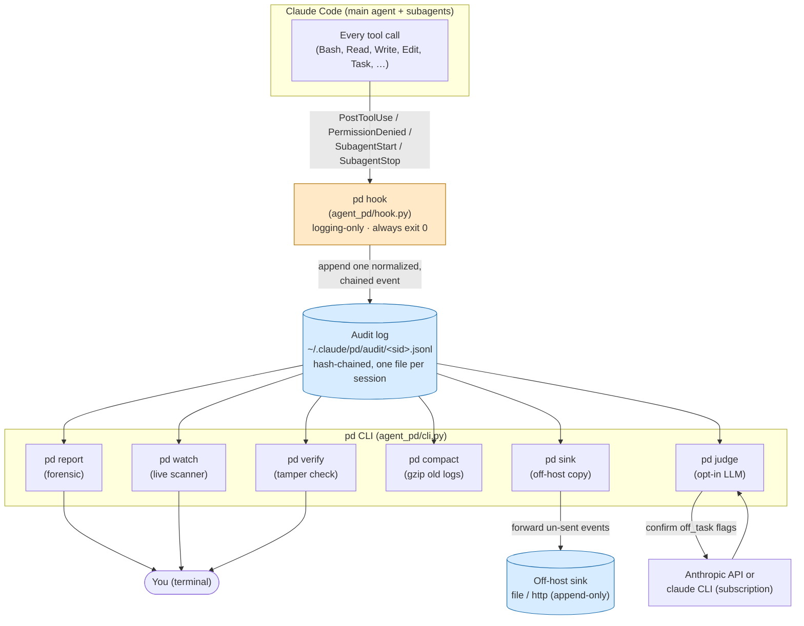
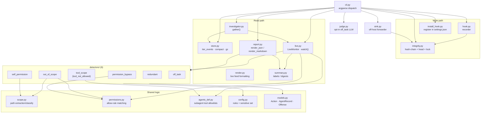
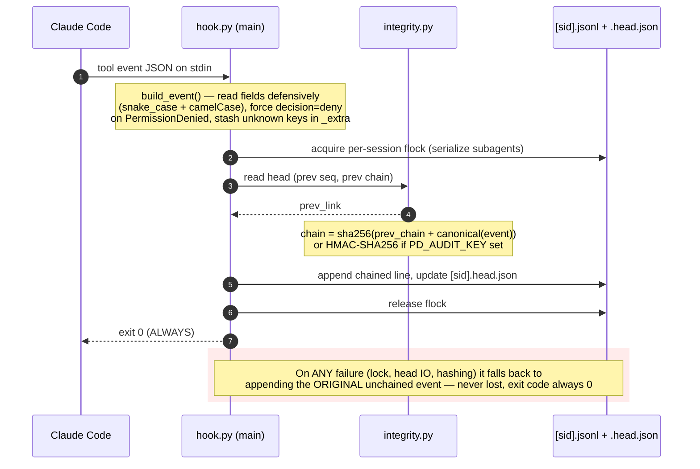
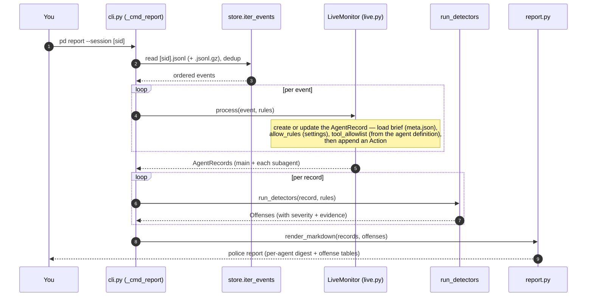
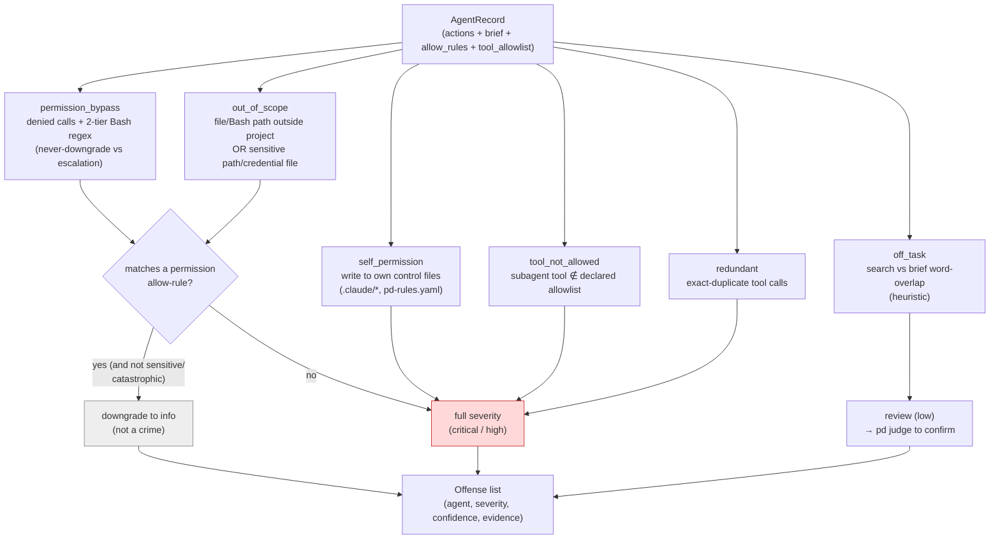
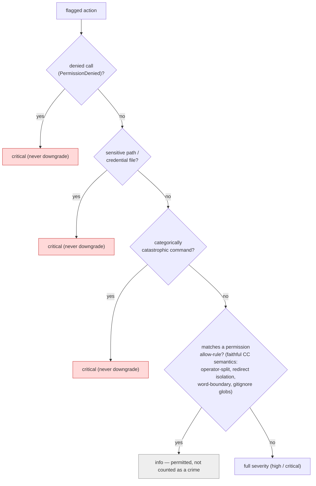
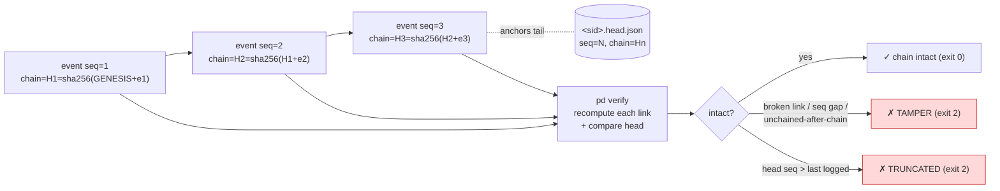
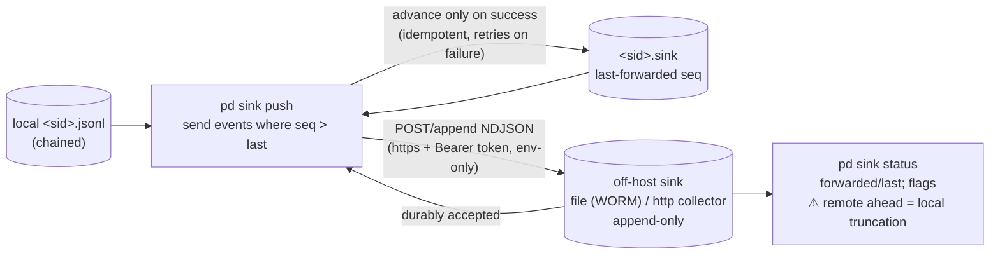
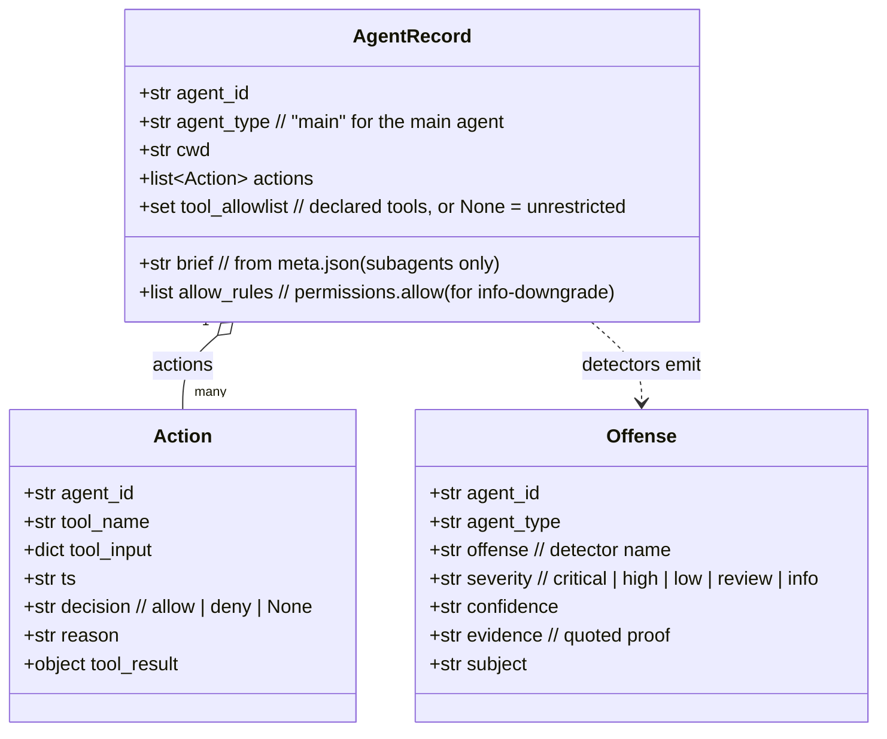

# agent-pd — Architecture & System Design

A visual, step-by-step walk through how agent-pd works, grounded in the actual code.
The diagrams are [Mermaid](https://mermaid.js.org/) — they render as images on GitHub and
in most Markdown viewers (VS Code, Obsidian, etc.). **Pre-rendered PNGs** of every diagram
(for slides/docs) live in [`docs/diagrams/`](docs/diagrams/README.md).

**One-sentence model:** a logging-only **hook** records every Claude Code tool call to a
per-session, hash-chained **audit log**; the **`pd` CLI** replays that log through six
**detectors** and reports rule offenses with quoted evidence. It *detects and reports* — it
never blocks.

---

## 1. System context — who talks to what

The big picture: where agent-pd sits relative to Claude Code, the disk, and you.



**Read it in one breath:** Claude Code fires a hook event on every tool call → the hook
appends a chained line to the session's audit log → the `pd` commands read that log to
report, watch, verify, compact, or forward it. The hook is the *only* writer; everything
else reads.

---

## 2. The two phases — capture vs. read

agent-pd has a deliberately dumb **write path** and a smart **read path**. They are
decoupled by the audit log on disk.

```mermaid
flowchart LR
    subgraph CAPTURE["CAPTURE — automatic, all sessions, zero intelligence"]
        direction TB
        E["hook event<br/>(JSON on stdin)"] --> BE["build_event()<br/>normalize fields"]
        BE --> CH["integrity.next_link()<br/>seq + chain hash"]
        CH --> AP["append line +<br/>update &lt;sid&gt;.head.json"]
    end

    LOG[("~/.claude/pd/audit/<br/>&lt;sid&gt;.jsonl(.gz)")]

    subgraph READ["READ — on demand, all the intelligence, zero tokens"]
        direction TB
        IT["store.iter_events()<br/>.jsonl + .jsonl.gz"] --> GA["investigator.gather()<br/>→ AgentRecords"]
        GA --> DET["run_detectors()<br/>6 detectors"]
        DET --> RND["render / report / live feed"]
    end

    AP --> LOG --> IT

    classDef cap fill:#ffe9c7,stroke:#b06f00;
    classDef rd fill:#e7f7e7,stroke:#2e7d32;
    class CAPTURE cap
    class READ rd
```



**Why split this way?**
- The hook must be **crash-safe and fast** — it runs on *every* tool call and must never
  break your agent. So it only normalizes + chains + appends, then exits 0.
- All the analysis (correlation, detection, rendering) happens later in the CLI, where it
  can be as smart as it likes and costs nothing on the hot path.
- **Denied calls only exist in the audit log** — Claude Code kills them before they reach
  the transcript — which is *why* the hook exists instead of just parsing transcripts.

---

## 3. Component diagram — the modules and how they depend

Every box is a real file under `agent_pd/`. Arrows mean "uses / calls".



**The dependency story:**
- `cli.py` is the switchboard — it routes each subcommand to its module.
- The **write path** (`hook.py` → `integrity.py`) is tiny and self-contained.
- The **read path** funnels through `store.iter_events` → `investigator.gather` →
  `LiveMonitor` → `run_detectors` → `render`.
- The **six detectors** lean on shared logic: `scope.py` (is this path in/out of bounds,
  sensitive?), `permissions.py` (did the user allow it?), `agents_def.py` (is this tool in
  the subagent's allowlist?), and `config.py` (the rules + sensitive list).

---

## 4. Sequence — how the hook records one tool call

What happens, in order, every single time an agent uses a tool.



**Key invariants visible here:**
- The hook **always exits 0** — it can never break your agent run.
- Events are **never lost** — if chaining fails, the raw event is still appended (it just
  shows up as a chain discontinuity in `pd verify`).
- A **per-session file lock** serializes concurrent subagents so the chain can't fork.
- `PermissionDenied` is forced to `decision=deny` from the event name — a denial is a
  denial even if a field says otherwise.

---

## 5. Sequence — what `pd report` does

The forensic read path, end to end.



`pd watch` is the **same pipeline**, except `LiveMonitor` *tails* the live `.jsonl` and
runs the detectors as each event arrives, printing a feed line + rap sheet instead of a
final report. One engine, two front-ends.

---

## 6. The detector pipeline — turning an Action into Offenses

For each `AgentRecord`, all six detectors run; each emits zero or more `Offense`s.



**The severity rule (the subtle part):** an `out_of_scope` or escalation hit that matches a
permission **allow-rule** you configured is downgraded to a quiet `info` (authorized → FYI,
not a crime). **Two things are never downgraded:** sensitive-path/credential access and
categorically-catastrophic commands (`rm -rf /`, `curl | sh`, …). A denied call stays
critical no matter what.

---

## 7. Permission-aware severity — the decision tree

Exactly how a single flagged action gets its final severity.



The bias is explicit: **ambiguity → not permitted (stays flagged)**. Under-flagging is
treated as worse than over-flagging.

---

## 8. Audit-log integrity — the hash chain

Every event is linked to the previous one, so tampering is detectable.



- `chain = sha256(prev_chain + canonical(event))`, or **HMAC-SHA256** if `PD_AUDIT_KEY` is
  set (then an attacker without the key can't forge a valid chain).
- `pd verify` catches **in-place edits, reordering, mid-deletion, tail truncation, and
  inserted unchained lines** (exit 2 on any).
- **Honest ceiling:** this is tamper-**evident**, not tamper-**proof**. A same-user agent
  can re-chain the whole file. The off-host sink (next section) closes the
  *retroactive-deletion* half of that gap. See `SECURITY.md`.

---

## 9. Off-host sink — moving the witness off the machine



The hook is **untouched** — there is no network on the hot path; the local log *is* the
spool. You run `pd sink push` on a schedule or from a Stop hook. The append-only guarantee
is a **deployment requirement** the destination must enforce (pd can't); the sink stops
retroactive *deletion* of shipped events, not forging or hook-disabling.

---

## 10. Data model — the three core shapes



- An **Action** is one recorded tool call.
- An **AgentRecord** is one agent (main or a subagent) with all its actions + the context
  detectors need (brief, allow-rules, tool allowlist).
- An **Offense** is one flagged finding with quoted evidence — what the report and live
  feed display.

---

## 11. On-disk layout

```
~/.claude/
├── settings.json                  # pd install-hook registers the hook here
└── pd/
    └── audit/
        ├── <sid>.jsonl            # live capture — the hook appends here
        ├── <sid>.jsonl.gz         # compacted (pd compact, gzip, lossless)
        ├── <sid>.head.json        # hash-chain tail anchor (tamper/truncation)
        ├── <sid>.lock             # per-session flock (serialize subagents)
        └── <sid>.sink             # last-forwarded seq (pd sink state)

~/.claude/projects/*/<sid>/subagents/
        └── agent-<id>.meta.json   # subagent brief (agentType + description) — read by gather()
```

Reads (`pd report`, `pd watch`) transparently handle both `.jsonl` and `.jsonl.gz` via
`store.iter_events`. The audit log lives **outside your repo**, so it's never committed by
accident — but it stores full tool inputs (which may include secrets in plaintext), so
treat it like any sensitive local file (see `SECURITY.md` → Privacy).

---

## 12. End-to-end, in words

1. **Setup (once):** `pd install-hook` adds the hook to `~/.claude/settings.json` for
   `PostToolUse`, `PermissionDenied`, `SubagentStart`, `SubagentStop`.
2. **Capture (automatic):** every tool call → hook normalizes + hash-chains + appends one
   line to `~/.claude/pd/audit/<sid>.jsonl`, then exits 0. All sessions record concurrently.
3. **Correlate (on read):** `store.iter_events` reads the log; `investigator.gather` /
   `LiveMonitor` rebuild per-agent `AgentRecord`s, attaching each agent's brief, allow-rules,
   and tool allowlist.
4. **Detect:** the six detectors run over each record, emitting `Offense`s; permission
   allow-rules downgrade non-sensitive hits to `info`.
5. **Present:** `pd report` renders a forensic markdown/JSON report; `pd watch` shows a live
   feed + rap sheet; `pd judge` optionally confirms `off_task` flags with an LLM.
6. **Protect the record:** `pd verify` proves the chain is intact; `pd compact` gzips old
   sessions losslessly; `pd sink push` forwards events off-host so they can't be quietly
   deleted later.

For the threat model and honest limitations, read `SECURITY.md`. For the formal design (goals,
components, permission model, trade-offs), read `SYSTEM-DESIGN.md`. To see it run end-to-end,
`bash examples/demo.sh`.
