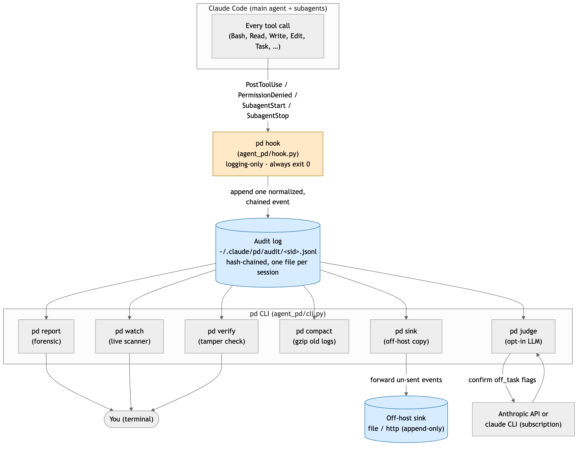
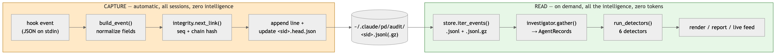
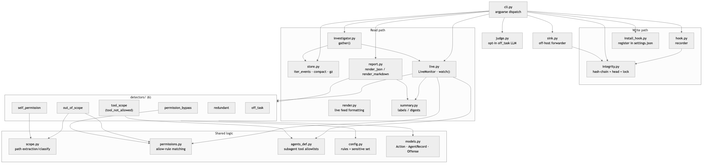
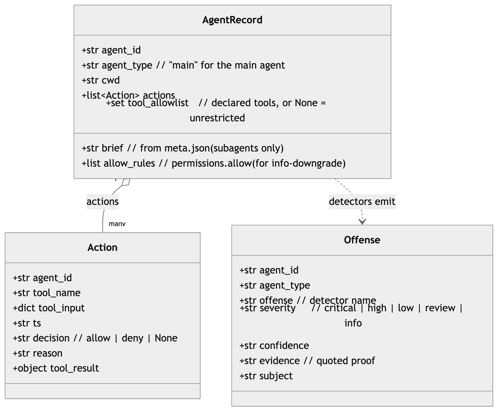
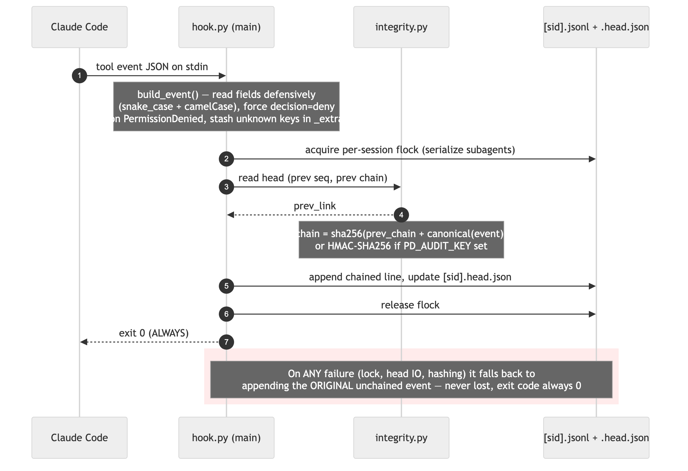
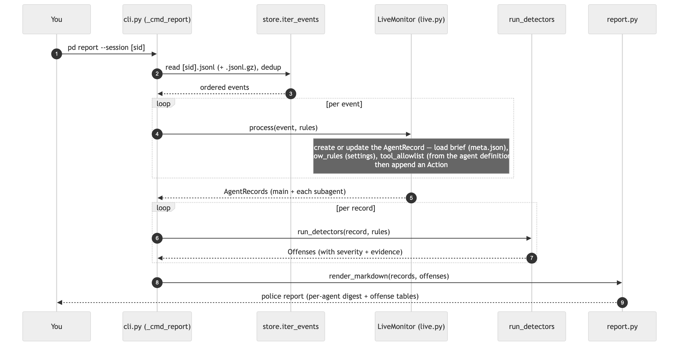
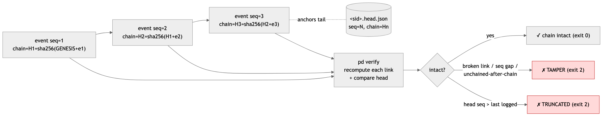
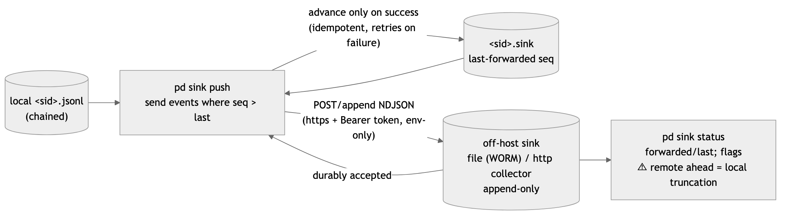
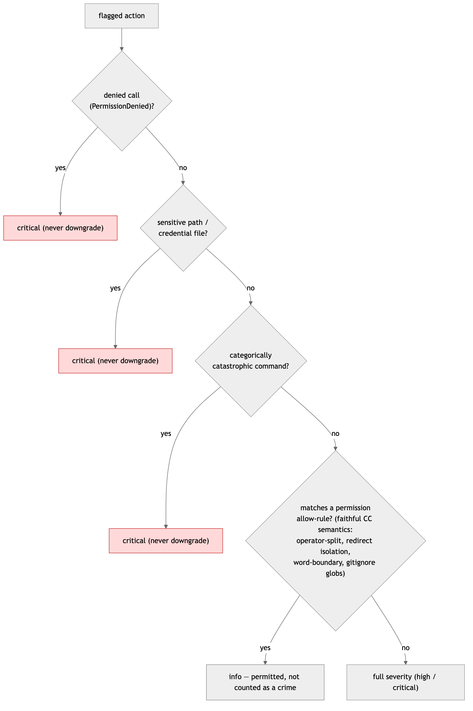
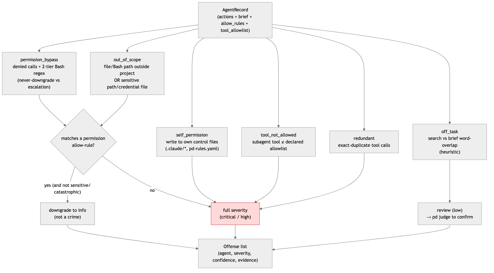

# agent-pd — System Design Document

**Status:** v0.1.0 · **Audience:** engineers evaluating, extending, or auditing agent-pd.
**Companion docs:** [`ARCHITECTURE.md`](ARCHITECTURE.md) (diagram-first walkthrough +
rendered images), [`SECURITY.md`](SECURITY.md) (threat model), [`HANDOFF.md`](HANDOFF.md)
(detector internals), [`KNOWN-GAPS.md`](KNOWN-GAPS.md) (ledger).

This is the prose system-design document: what agent-pd is, the requirements it meets, how
it is structured, the decisions behind it, and where it stops.

---

## 1. Purpose

Claude Code agents (the main interactive agent and the subagents it spawns) can read files,
run shell commands, and act with the user's privileges. Today the only record of what an
agent *did* is its transcript — and **denied tool calls never reach the transcript at all**
(Claude Code kills them first). agent-pd gives an operator an independent, durable,
queryable record of every tool call and a deterministic way to flag misbehavior:
out-of-scope access, credential reads, permission bypass, an agent editing its own config,
a subagent using a disallowed tool, and off-task work.

**agent-pd detects and reports. It never blocks.** It is a flight recorder and a police
scanner, not a firewall. Stopping an action remains the job of Claude Code's own permission
prompts or an OS sandbox.

---

## 2. Goals and non-goals

**Goals**
- **Faithful capture.** Record every tool/permission event from the main agent and all
  subagents, including denied calls, without ever interfering with the agent run.
- **Deterministic detection.** Flag offenses from facts in the log, with quoted evidence,
  at zero token cost. Under-flagging is treated as worse than over-flagging.
- **Tamper-evidence.** Make after-the-fact edits, truncation, and reordering of the audit
  log detectable; optionally move the record off-host so it can't be quietly deleted.
- **Honesty.** Document the exact ceiling of every guarantee. Never let a "tamper-evident"
  feature be read as "tamper-proof."

**Non-goals**
- **Blocking / intervention.** The hook is logging-only and always exits 0.
- **Sandboxing.** pd does not contain or constrain an agent; a determined same-privilege
  adversary using obfuscation can evade static detection.
- **A live tap into Claude Code's permission engine.** pd cross-checks against the same
  *persisted* permission config Claude Code uses (see §9); it does not intercept the
  runtime allow/deny decision except where Claude Code emits a `PermissionDenied` event.

---

## 3. Design principles (load-bearing invariants)

1. **The hook never blocks and always exits 0.** It can never break an agent run, and it
   never loses an event — on any internal failure it falls back to appending the raw
   (unchained) event.
2. **Dumb write path, smart read path.** The hook only normalizes, chains, and appends. All
   correlation and detection happen later in the CLI, off the hot path, at zero token cost.
3. **The audit log is the single source of truth.** `pd report` and `pd watch` both replay
   the same log through the same engine, so they agree and both cover main + subagents.
4. **Faithful, conservative detection.** Permission matching mirrors Claude Code semantics;
   ambiguity resolves to *not permitted* (stays flagged). Sensitive-path access and
   categorically-catastrophic commands are **never** downgraded.
5. **Lossless storage.** `pd compact` is gzip-only; every field stays inline, so detection
   over a compacted session is identical to the raw session.

---

## 4. Requirements

**Functional**
- Capture `PostToolUse`, `PermissionDenied`, `SubagentStart`, `SubagentStop` events to a
  per-session audit log.
- Correlate events into per-agent records (with brief, allow-rules, tool allowlist).
- Run six deterministic detectors and an optional LLM judge for the heuristic one.
- Render a forensic report (`pd report`), a live feed (`pd watch`), integrity verification
  (`pd verify`), compaction (`pd compact`), and off-host forwarding (`pd sink`).

**Non-functional**
- **Crash-safety / non-interference:** hook always exits 0, no network on the hot path.
- **Concurrency:** many subagents append to one session file safely (per-session file lock
  for the chain; readers skip malformed/partial lines).
- **Portability:** standard library only (PyYAML the lone runtime dependency); Python ≥3.11.
- **Cost:** deterministic detectors cost zero tokens; the judge is opt-in and cost-capped.

---

## 5. System overview



Claude Code fires a hook on every tool call → the hook appends one normalized, hash-chained
line to `~/.claude/pd/audit/<sid>.jsonl` → the `pd` commands read that log to report, watch,
verify, compact, or forward it. The hook is the only writer; everything else reads. The two
phases are decoupled by the log on disk:



---

## 6. Components and responsibilities



| Module | Responsibility |
|---|---|
| `hook.py` | The recorder. Normalize the stdin event (snake_case **and** camelCase), force `decision=deny` on `PermissionDenied`, preserve unknown fields under `_extra`, hash-chain, append, exit 0. |
| `integrity.py` | Hash-chain core: `seq` + `chain = sha256(prev_chain + canonical(event))` (HMAC if `PD_AUDIT_KEY`), per-session file lock, `<sid>.head.json` anchor, `verify_events`. |
| `install_hook.py` | Idempotently register the hook in `~/.claude/settings.json`. |
| `store.py` | Transparent reads over `.jsonl` + `.jsonl.gz`, gzip compaction, prune, dedup across the compaction window. |
| `investigator.py` | `gather()` — replay the log through `LiveMonitor` into `AgentRecord`s; attach each agent's brief from `meta.json`. |
| `live.py` | `LiveMonitor` (the shared correlation engine) + `watch()` (tail + live feed). |
| `detectors/` | The six detectors (`permission_bypass`, `out_of_scope`, `self_permission`, `tool_scope`, `redundant`, `off_task`) + the registry/runner. |
| `scope.py` | Path extraction from Bash (incl. interpreter one-liners, single-level `$VAR`, sensitive basenames) and classification (in-project / boundary / sensitive). |
| `permissions.py` | Load `permissions.allow` from the settings files and match it with faithful Claude Code semantics. |
| `agents_def.py` | Parse a subagent's declared `tools:` allowlist from `.claude/agents/<type>.md`. |
| `config.py` | Rules + the default sensitive set; deep-merge `pd-rules.yaml`. |
| `models.py` | `Action`, `AgentRecord`, `Offense` dataclasses. |
| `report.py` / `render.py` / `summary.py` | Forensic markdown/JSON; live-feed formatting; labels/digests. |
| `judge.py` | Opt-in LLM pass to confirm `off_task` flags (API or `claude` CLI backend). |
| `sink.py` | Off-host forwarder (file/http), incremental + idempotent, env-only token. |
| `cli.py` | argparse switchboard routing each subcommand to its module. |

---

## 7. Data model



- **`Action`** — one recorded tool call (`tool_name`, `tool_input`, `decision`, `reason`,
  `tool_result`).
- **`AgentRecord`** — one agent (main or subagent) with its actions plus the context
  detectors need: `brief`, `allow_rules`, `tool_allowlist`.
- **`Offense`** — one flagged finding: `offense`, `severity`, `confidence`, quoted
  `evidence`.

---

## 8. Key flows

### 8.1 Capture (per tool call)



Normalize → acquire per-session lock → read head → compute chain → append + update head →
release → exit 0. Any failure falls back to appending the raw event (never lost).

### 8.2 Correlate and detect (`pd report` / `pd watch`)



`store.iter_events` → `LiveMonitor.process` builds `AgentRecord`s (loading brief, allow-rules,
tool allowlist) → `run_detectors` emits `Offense`s → render. `pd watch` is the same engine
tailing the live file and printing a feed + rap sheet instead of a final report.

### 8.3 Integrity



`pd verify` recomputes each link and compares the head anchor, catching in-place edits,
reordering, mid-deletion, tail truncation, and inserted unchained lines (exit 2 on any).

### 8.4 Off-host sink



`pd sink push` forwards only un-sent chained events (`seq > last`) and advances per-session
state only on durable acceptance — incremental, idempotent, retrying on failure. The hook is
untouched; the local log is the spool.

---

## 9. Permission model — how pd cross-checks what you authorized

This is the part most worth being precise about, because pd's "this was permitted" verdict
is only as meaningful as the source it checks against.

**What pd checks against.** `permissions.load_allow_rules()` reads `permissions.allow` from
the **same configuration files Claude Code uses**:

- `$CLAUDE_CONFIG_DIR/settings.json` and `settings.local.json` (defaults to `~/.claude/`)
- `<project>/.claude/settings.json` and `settings.local.json`

It then matches an action against those rules with **faithful Claude Code semantics**:
shell-operator splitting (a `Bash(git:*)` rule does **not** license `git status && rm -rf ~`),
command-substitution / backtick extraction, redirect targets as a separate authorization
(a command rule can't license `> ~/.ssh/authorized_keys`), word-boundary prefixes
(`npm install:*` ≠ `npm installmalware`), gitignore-style globs (`*` does not cross `/`,
`**` does), and process-wrapper stripping (`timeout`, `nice`, …). A match downgrades the
offense to a quiet `info` (permitted → FYI, not a crime).



**So, concretely — does it honor the permissions you granted?**

| What you did in Claude Code | Does pd honor it? | Why |
|---|---|---|
| Added a **persistent allow-rule** (`permissions.allow`) | ✅ Yes | pd reads the same settings files and matches with CC semantics → `info` |
| Claude Code **denied** a call (deny-rule or you declined) | ✅ Yes | captured live as a `PermissionDenied` event → always `critical` |
| Clicked **"Allow once"** on an interactive prompt | ❌ No | that approval is never persisted to settings, so pd can't see it → the action stays at full severity |

**The boundary, stated plainly.** pd is a **cross-check against the same persisted permission
config** Claude Code uses — not a live tap into Claude Code's runtime decision. The only
runtime decision it observes directly is a **denial** (the `PermissionDenied` event). For
*allows*, it re-derives authorization from the persisted rules. Consequences:

- A one-time interactive approval is invisible to pd, so such an action is flagged at full
  severity. This is the intended bias: when pd can't *prove* authorization, it flags.
- Allow-rules are loaded **once per agent** (at its first event); a mid-session edit to
  `permissions.allow` is not picked up until the next run.
- **Sensitive-path access and categorically-catastrophic commands are never downgraded**,
  no matter what allow-rule you wrote. A denial is always critical.

---

## 10. Detection model



| Detector | Severity | Confidence | Basis |
|---|---|---|---|
| `permission_bypass` | critical | high | denied calls + two-tier Bash regex (never-downgrade catastrophic vs downgradable escalation) |
| `out_of_scope` | high / critical | high | file/Bash path outside the project, or a sensitive path / credential file (by basename, any command) |
| `self_permission` | critical | high | any write to the agent's own control files, any method |
| `tool_not_allowed` | high | high | subagent uses a tool outside its declared allowlist |
| `redundant` | low | high | exact-duplicate tool calls |
| `off_task` | review | **low — heuristic** | search vs brief word-overlap; confirmed by `pd judge` |

Five are deterministic and trustworthy; `off_task` is hard-labeled low-confidence and is the
only one that benefits from the optional LLM judge.

---

## 11. Security model (summary)

Full account in [`SECURITY.md`](SECURITY.md). In brief:

- **Tamper-evident, not tamper-proof.** The hash chain catches corruption, truncation,
  reordering, and naive edits. A same-user agent with Bash can re-chain the whole file, so
  set `PD_AUDIT_KEY` in an environment the agent can't read for keyed integrity, and ship to
  an off-host append-only sink to defeat retroactive deletion. Append-only is a deployment
  requirement pd can't enforce; the sink doesn't stop forging or hook-disabling.
- **Static-analysis limits.** Multi-level `$VAR` chains, `$IFS`/word-split, two-step
  download-then-exec, and base64/eval-assembled commands can evade detection. pd raises the
  bar; it is not a sandbox.
- **Privacy.** The audit log stores full tool inputs (which may include secrets in
  plaintext) under `~/.claude/pd/audit/`, outside the repo. gzip compresses, not encrypts.

---

## 12. Trade-offs and alternatives considered

- **Logging-only vs blocking.** Chosen logging-only so the hook can never break an agent and
  always exits 0. Blocking was a non-goal (that's CC's permission prompts / an OS sandbox).
- **gzip-only compaction vs a blob store.** An earlier design externalized large
  `tool_input` fields into a content-addressed blob store; it broke detection-losslessness
  (detectors read those fields) and was reverted. Compaction is gzip-only and inline.
- **Re-deriving permissions vs intercepting them.** pd reads the persisted allow-rules and
  re-implements CC's matching rather than hooking the live decision, because the only runtime
  signal available without `PreToolUse`/`PermissionRequest` hooks is the `PermissionDenied`
  event. This is simpler and CC-version-robust, at the cost of not seeing interactive
  approvals (§9).
- **Conservative bias.** Ambiguous matches resolve to *not permitted*. Over-flagging a
  permitted action as a reviewable item is preferred to silently clearing a real one.

---

## 13. Limitations

- Non-Bash MCP file-write tools can bypass `self_permission` (only Write/Edit/NotebookEdit +
  Bash are inspected).
- `off_task` is heuristic and can't run on the main agent or Workflow subagents (no brief).
- `~/.config` sensitivity is broad and can be noisy.
- Symlink resolution is best-effort (symlink must exist at analysis time).
- Sessions predating the hook (transcript-only) don't appear in `pd report`.

Full ledger: [`KNOWN-GAPS.md`](KNOWN-GAPS.md).

---

## 14. Future work

Tool-agnostic control-file detection (close the MCP `self_permission` gap); multi-level
`$VAR` resolution; `tool_result` truncation at capture; narrower `~/.config` sensitivity;
sink chunking + a syslog backend + `pd verify --against-sink`; `pd summary <session>`; a
judge verdict cache; capturing `PostToolUseFailure` / `SessionEnd` to enrich timelines.

---

## 15. Appendix — on-disk layout & commands

```
~/.claude/
├── settings.json                  # pd install-hook registers the hook here
└── pd/audit/
    ├── <sid>.jsonl                # live capture (hook appends)
    ├── <sid>.jsonl.gz            # compacted (gzip, lossless)
    ├── <sid>.head.json           # hash-chain tail anchor
    ├── <sid>.lock                # per-session flock
    └── <sid>.sink                # last-forwarded seq (sink state)
~/.claude/projects/*/<sid>/subagents/agent-<id>.meta.json   # subagent brief
```

**Commands:** `pd install-hook` · `pd list` · `pd report` · `pd watch` · `pd verify` ·
`pd compact` · `pd sink push|status` · `pd judge`. See [`README.md`](README.md) for full
usage and `examples/demo.sh` for a reproducible end-to-end run.
