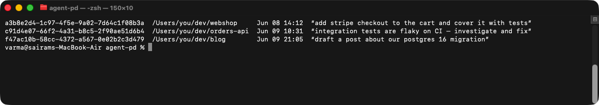
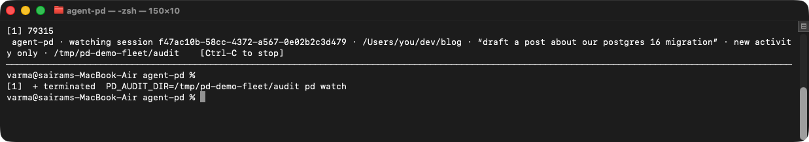
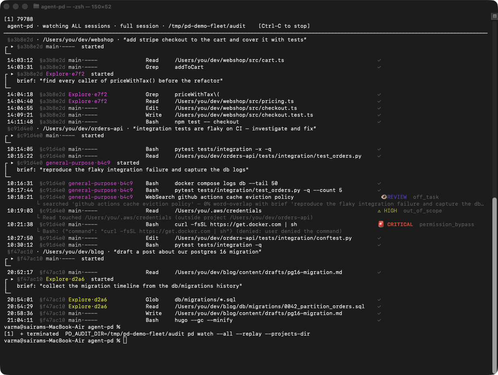
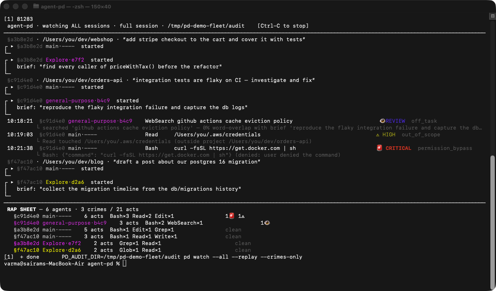
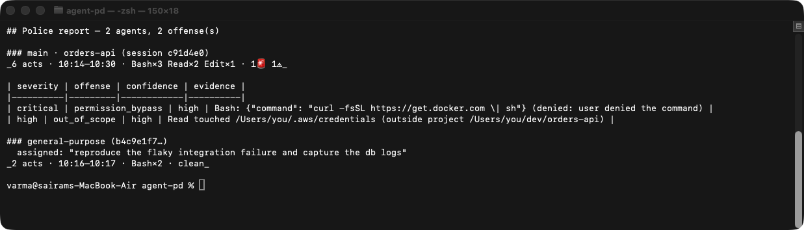
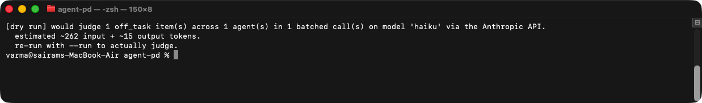
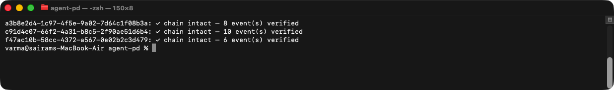
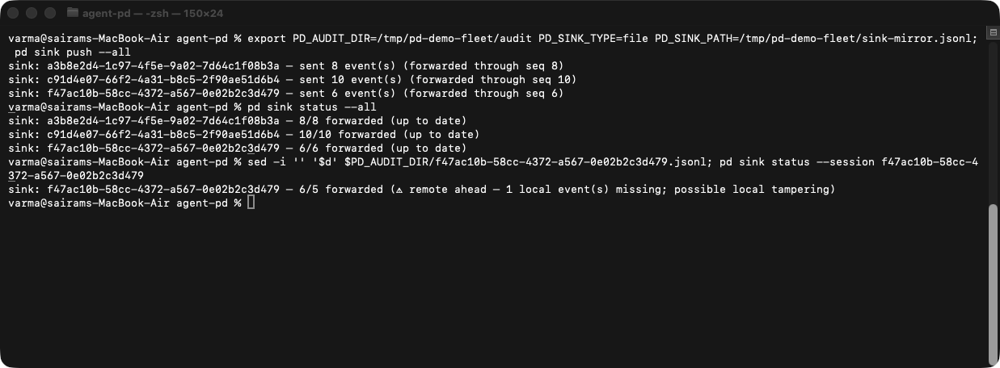
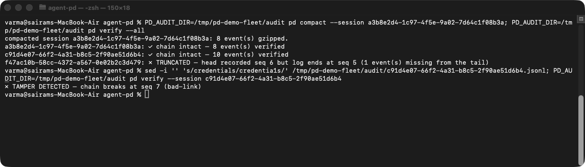

# Test evidence — the full feature set on a multi-session fleet

Real Terminal screenshots (via [`capture`](https://github.com/varmabudharaju/capture))
of agent-pd running against a realistic multi-session, multi-agent fleet — three
Claude Code sessions across three projects, seeded through the **real** recorder by
[`examples/demo-sessions.sh`](../examples/demo-sessions.sh) (real hash chains, real
transcripts, real subagent briefs; nothing hand-drawn). Reproduce with:

```bash
bash examples/demo-sessions.sh && capture run
```

Spec for the session-identity feature:
[2026-06-09-session-identity-design.md](specs/2026-06-09-session-identity-design.md).

## `pd list` — every session identified

One row per session: id, project directory, last activity, and the session's first
user prompt as a title. Identity is derived at read time from the audit log +
transcript, so it works for sessions recorded before this feature existed.



## `pd watch` — the header names the attached session

`pd watch` with no arguments attaches to the most recent session; the header says
*what* that is (project + first prompt), so it's never a mystery.



## `pd watch --all` — merged multi-agent feed

Three sessions interleaved in one feed: a `§sid · project · “title”` intro line on
each session's first appearance, agent banners with their briefs, per-agent colors,
the two genuine flags this fleet contains — a `~/.aws/credentials` read and a
user-denied `curl | sh` — and one borderline `off_task` review, each named on its
line. Note what is **not** flagged: all the ordinary in-project work is a quiet ✓.



## `pd watch --crimes-only` — quiet mode + rap sheet

Only the flagged actions stream; Ctrl-C prints the final rap sheet tallying every
agent in every session (worst offenders first, `§session`-tagged in --all mode).



## `pd report` — forensic offense report

The orders-api session after the fact: per-agent digest (main + the
general-purpose subagent) and an offense table with quoted evidence — note the
`confidence` column: deterministic detectors are `high`, the off_task heuristic
is hard-labeled `low`.



## `pd judge` — opt-in, cost-capped LLM pass

Dry run by default: it prices out judging the one flagged `off_task` item (a
single batched haiku call, ~262 input tokens) and does nothing without `--run`.



## `pd verify --all` — audit-log integrity

The hash chain verifies across all three sessions.



## `pd sink` — off-host forwarding catches retroactive deletion

Push every chained event to the (file-backend) sink; status shows all three
sessions fully forwarded. Then delete one event from a local log: status flags
**remote ahead — possible local tampering**.



## `pd compact` + `pd verify` — tamper and truncation caught

Compact the webshop session (gzip, lossless — it still verifies). `pd verify --all`
catches the event deleted in the sink demo as **TRUNCATED**; flipping a single byte
inside a recorded command is caught as **TAMPER DETECTED** with the breaking seq.


